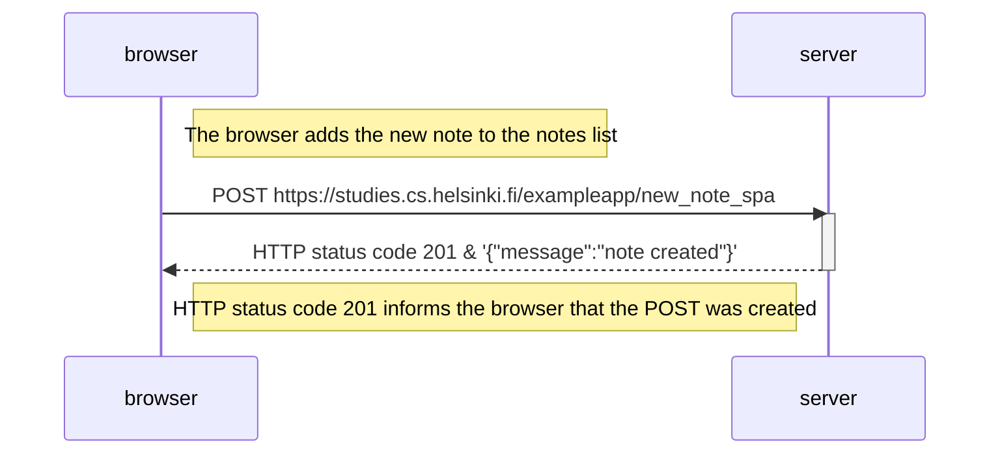

```mermaid
sequenceDiagram
    participant browser
    participant server

    Note right of browser: The browser adds the new note to the notes list 

    browser->>server: POST https://studies.cs.helsinki.fi/exampleapp/new_note_spa
    activate server
    server-->>browser: HTTP status code 201 & '{"message":"note created"}'
    deactivate server

    Note right of browser: HTTP status code 201 informs the browser that the POST was created


```
