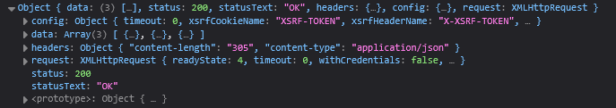

# [Getting data from server](https://fullstackopen.com/en/part2/getting_data_from_server)

For a while now we have only been working on "frontend", i.e. client-side (browser) functionality. We will begin working on "backend", i.e. server-side functionality in the third part of this course. Nonetheless, we will now take a step in that direction by familiarizing ourselves with how the code executing in the browser communicates with the backend.

Let's use a tool meant to be used during software development called [JSON Server](https://github.com/typicode/json-server?tab=readme-ov-file) to act as our server.

- Create _db.json_ file in root directory of _notes_ project
  - Content:

```json
{
  "notes": [
    {
      "id": "1",
      "content": "HTML is easy",
      "important": true
    },
    {
      "id": "2",
      "content": "Browser can execute only JavaScript",
      "important": false
    },
    {
      "id": "3",
      "content": "GET and POST are the most important methods of HTTP protocol",
      "important": true
    }
  ]
}
```

- Run command to start server: `npx json-server --port 3001 db.json`
- From now on, we will save notes to server, and recieve them from the server to render
  - It is like having "memory"
- In real world, databases are used, but JSON Server is nice for small apps

### The browser as a runtime environment

- Need to fetch notes from address http://localhost:3001/notes to React app
  - Can be done using fetch method, based on promises
- JavaScript uses an asynchronous model for most I/O operations  
- This means I/O functions like network requests or file reads are non-blocking
  - Code execution continues immediately after calling an async function  
  - When the operation finishes, the event handler callback is called
- JavaScript engines in browsers and Node.js run in a single thread
  - Only one task can execute at a time  
  - Blocking operations like waiting for a response would freeze the entire app  
  - To prevent this, I/O must be non-blocking and asynchronous
- Summary
  - JavaScript continues running while waiting for I/O to finish  
  - The result of the async task is handled later via callback, promise, or async/await  
  - This design is necessary to keep the UI responsive and the event loop unblocked
- Analogy: Ordering Food
  - Synchronous  
    - You order food  
    - You stand and wait doing nothing until it’s ready  
  - Asynchronous  
    - You order food  
    - You go back to your table  
    - The waiter brings the food when it’s ready  
- JavaScript behaves like the asynchronous model
- Code Comparison
  - Synchronous blocking

  ```js
  const data = fetchData() // blocks  
  console.log(data)        // waits for fetchData to finish  
  ```

  - Asynchronous non-blocking

  ```js
  fetchData().then(data => {
   console.log(data)      // runs later
  })
  console.log("Fetching...") // runs immediately
  ```

	| Feature               | Synchronous Blocking        | Asynchronous Non-blocking JS |
	|----------------------|-----------------------------|-------------------------------|
	| Thread behavior      | Waits for each task to finish | Moves on immediately         |
	| I/O operations       | Block further code          | Run in background             |
	| UI responsiveness    | Can freeze the UI           | Keeps UI responsive           |
	| Example languages    | Java, Python default        | JavaScript, Node.js           |
	| Callback/event model | Not needed                  | Required to handle later results |

### npm

- To get data from server we can use promise-based function fetch
  - Using [axios](https://github.com/axios/axios) instead 
  - It is similar to fetch
- External libraries are called _npm packages_ for React projects
  - Most JS projects defined using not package manager
  - _package.json_ contains information for all libraries and dependencies
- We can install axios by running the command in cmd: 

```
npm install axios
```

- Axios is listed under dependencies in _package.json_
  - The code was also downloaded, and can be found in the _node module_ directory
- Also install _jason-server_ as a development dependency
  - This means it will only be used during development, not when app running in production

```
npm install json-server --save-dev
```

- Make an addition to the _scripts_ portion of _package.json_
  - This will allow us to start the server easily using `npm run server`:

```json
"server": "json-server -p 3001 db.json"
```

- Many more dependencies will be used in the future

### Axios and promises

- Libraries brough into use by calling `import`
- Added following code to _main.jsx_:

```jsx
import axios from 'axios'

const promise = axios.get('http://localhost:3001/notes')
console.log(promise)

const promise2 = axios.get('http://localhost:3001/foobar')
console.log(promise2)
```

- Axios' `get` method returns a promise
  - "A Promise is an object representing the eventual completion or failure of an asynchronous operation."
  - So, promise is object that represents asynchronous operation
  - It can have three states:
    - _Pending_: asynch operation not done yet, so final value not available
    - _Fulfilled_: asynch operation done, so final value available, which means success
    - _Rejected_: error prevented final value from being determined, which means failure 
- _console_ shows that first promise was _fulfilled_, so successful `axios.get()` request
  - Second was _rejected_, and console gives us reason that HTTP GET request to non-existent address
- To access result of operation represented by promise we use event handler
  - Done through `then` method:

```jsx
const promise = axios.get('http://localhost:3001/notes')

promise.then(response => {
  console.log(response)
})
```

- Output: 


- `then` method gets callback function with `response` object as param
  - `response` object carries important returned data of HTTP GET request such as _data_, _status code_, and _headers_
- Promise object generally not stores in variable, instead everything is done in one line:

```jsx
axios.get('http://localhost:3001/notes').then(response => {
  const notes = response.data
  console.log(notes)
})
```

- Callback function stores data from `response` object and stores it in variable called notes
- Better way to format chained method is to put then in separate line:

```jsx
axios
  .get('http://localhost:3001/notes')
  .then(response => {
    const notes = response.data
    console.log(notes)
  })
```

- Data returned by server is plain text (one long string) which axios library can still parse
  - Parses into JS array since server specifies that data format is _application/json_ (see previous image) using content type header
- Now you can use the fetched data
  - Typically the data is fetched in _App_ component

### Effect-hooks

- Effect hooks let component connect to and synchronize with external sysmtems like network, browser DOM and more
  - These are what we will use to fetch data from server
- Simplify _main.jsx_ since we will fetch from server:

```jsx
import ReactDOM from "react-dom/client";
import App from "./App";

ReactDOM.createRoot(document.getElementById("root")).render(<App />);
```

- Change _App_ component:

```jsx
import { useState, useEffect } from 'react'
import axios from 'axios'
import Note from './components/Note'

const App = () => {
  const [notes, setNotes] = useState([])
  const [newNote, setNewNote] = useState('')
  const [showAll, setShowAll] = useState(true)

  useEffect(() => {
    console.log('effect')
    axios
      .get('http://localhost:3001/notes')
      .then(response => {
        console.log('promise fulfilled')
        setNotes(response.data)
      })
  }, [])
  console.log('render', notes.length, 'notes')

  // ...
}
```

- The console logs tell us that its working:

```
render 0 notes
effect
promise fulfilled
render 3 notes
```

- _App_ component first run
  - `useEffect` registered but function inside not yet run
  - Component is rendered to virtual DOM and all JSX and state is evaluated
- Now that intial render is done, commit phase occur
  - React updates real DOM 
  - React will run the function inside of `useEffect`
    - This is intended to prevent slowing down updates
    - Its also for side effects, not computing what the UI will look like
- This is why 'render 0' is printer to console, followed by logs from within `useEffect` function 
  - When function inside gets executed, `axios.get` starts fetching data from server and registers following function as an _event handler_ for the operation:

```jsx
response => {
  console.log('promise fulfilled')
  setNotes(response.data)
}
```

- When the data arrives from the server, the registered _event handler_ is called 
  - It prints 'promise fulfilled' 
  - Data is stored into notes state using `setNotes(response.data)`
  - Calling a state updating function causes a re-render, which displays the notes
  - This re-render doesn't cause `useEffect` to register again because its dependency array is empty
    - When something in the dependency array changes, React will execute the function in `useEffect`
    - ie. if dependency array was `[notes]` then the _App_ component would be stuck in an infinite loop 
- The code can be rewritten:

```jsx
const hook = () => {
  console.log('effect')
  axios
    .get('http://localhost:3001/notes')
    .then(response => {
      console.log('promise fulfilled')
      setNotes(response.data)
    })
}

useEffect(hook, [])
```

- `useEffect` takes two params
  1. A function, the effect itself
      > _By default, effects run after every completed render, but you can choose to fire it only when certain values have changed._
  2. Dependency array which specifies how often effect should be run
      - We wanted effect to run after first render only, so we left dependency array empty
      - If no dependency array is provided, then the default action occurs
- The code could also have been written as follows:

```jsx
useEffect(() => {
  console.log('effect')

  const eventHandler = response => {
    console.log('promise fulfilled')
    setNotes(response.data)
  }

  const promise = axios.get('http://localhost:3001/notes')
  promise.then(eventHandler)
}, [])
```

- Next we will store new notes on the server

### The development runtime environment

- Review time
  - Following image describes makeup of app:


- JS for our app runs on browser, which it gets from the _React dev server_ 
  - That server runs when we run the command `npm run dev`
  - Server tranforms JS into browser understood format 
  - Server stiches together JS from many different files into one file
  - Will be further discussed in Part 7 
- React app on browser gets JSON data from JSON Server running on port 3001 on the machine
  - The server we query the data from (JSON Server) gets its data from db.json
- Currently, everything resides on software developer's machine
  - This is called localhost
  - This will change when app is deployed to internet in Part 3
- 