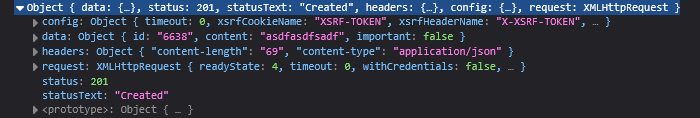

# [Altering data in server](https://fullstackopen.com/en/part2/altering_data_in_server)

When creating notes in our application, we would naturally want to store them in some backend server. The json-server package claims to be a so-called REST or RESTful API in its documentation:

    Get a full fake REST API with zero coding in less than 30 seconds (seriously)

The json-server does not exactly match the description provided by the textbook definition of a REST API, but neither do most other APIs claiming to be RESTful.

We will take a closer look at REST in the next part of the course. But it's important to familiarize ourselves at this point with some of the conventions used by json-server and REST APIs in general. In particular, we will be taking a look at the conventional use of routes, aka URLs and HTTP request types, in REST.

### REST

- In REST individual objects, such as notes, are resources
  - Every resource has unique address in form of URL
  - JSON Server convention is individual note address is at _notes/3_ where the notes ID is 3 and _notes_ URL is list of all notes
- Resources fetched from server using HTTP GET request 
  - HTTP GET to _notes/3_ URL returns note with ID: 3
  - HTTP GET to _notes_ URL returns list of all notes
- Creating new resource done using HTTP POST request 
  -  For new note, send request to _notes_ URL that JSON server adheres to
  -  Data for new note resource stored in _body_ of request
-  Sending data to JSON Server requires JSON format
   -  Data must be a correctly formatted string and request contains _Content-type_ request header with value _application/json_ 

### Sending Data to the Server

- Change _addNote_ event handler:

```jsx
addNote = event => {
  event.preventDefault()
  const noteObject = {
    content: newNote,
    important: Math.random() < 0.5,
  }

  axios
    .post('http://localhost:3001/notes', noteObject)
    .then(response => {
      console.log(response)
    })
}
```

- Omit id property since it is better handled by the server
  - Server auto generates id's
- Object send to server using axious `post` method
  - Logged output:



- New note resource stored under _data_ property of `response` object 
- Headers for POST request are correct:


- Axios automitically knew to set to appropriate value for _Content-type_ header due to out JS object
- In _Network_ tab, after clicking on an event, the _Request_ tab shows the payload
  - The _Response_ tab shows what the server responded with
- We can cause the note to be rendered to the screen now:

```jsx
axios
  .post('http://localhost:3001/notes', noteObject)
  .then(response => {
    setNotes(notes.concat(response.data));
    setNewNote('');
  });
```

- We `concat` the response data
  - It is how we have always done it
- When working with server, new problems will arise
  - We will need new debugging strats and console logging
  - Need to have good understanding of JS runtime and React components
- Can inspect state of backend server
  - Can be done through browser, ie. `http://localhost:3001/notes`
- This is discussed further in the next part

### Changing the Importance of Notes

- Add button to every note to toggle importance
- New _Note_ component:

```jsx
const Note = ({ note, toggleImportance }) => {
  const label = note.important
    ? 'make not important' : 'make important'

  return (
    <li>
      {note.content} 
      <button onClick={toggleImportance}>{label}</button>
    </li>
  )
}
```

- This adds a button with event handler `toggleImportance` to every note
- Test it:

```jsx
const App = () => {
  const [notes, setNotes] = useState([]) 
  const [newNote, setNewNote] = useState('')
  const [showAll, setShowAll] = useState(true)

  // ...

  const toggleImportanceOf = (id) => {
    console.log(`importance of ${id} needs to be toggled`)
  }

  // ...

  return (
    <div>
      <h1>Notes</h1>
      <div>
        <button onClick={() => setShowAll(!showAll)}>
          show {showAll ? 'important' : 'all' }
        </button>
      </div>      
      <ul>
        {notesToShow.map(note => 
          <Note
            key={note.id}
            note={note} 
            toggleImportance={() => toggleImportanceOf(note.id)}
          />
        )}
      </ul>
      // ...
    </div>
  )
}
```

- Had to `toggleImportance={() => toggleImportanceOf(note.id)}` since `toggleImportanceOf()` takes a parameter
- Every note has unique event handler since the id's are all unique
- Can modify individual notes in JSON-server in two ways
  1. _replace_ the entire note with HTTP Put request
  2. or change some of note's properties with HTTP Patch request

```jsx
const toggleImportanceOf = id => {
  const url = `http://localhost:3001/notes/${id}`
  const note = notes.find(n => n.id === id)
  const changedNote = { ...note, important: !note.important }

  axios.put(url, changedNote).then(response => {
    setNotes(notes.map(note => note.id === id ? response.data : note))
  })
}
```

- First line defines unique URL for note based on id
- `find()` method returns first object that matches condition and stores it in `note` var
- Next, an exact copy of the note is created
  - But the value of `important` is flipped
  - We do not directly manipulate value of notes since it is state, that is why we create a temporary value 
  - `changedNote` is a shallow copy, so the values are the same; however, if the values of the old object were objects, then the copied values in the new object would reference the same objects that were in the old object
- New note sent to server via PUT request, causing it to replace the old note at URL
- Callback function updates `notes` state by keeping all previous items, except for the old note which gets replaced by the updated version
  - This is done using `map`, which returns a new array that has the map applied to it

### Extracting Communication with the Backend into a Separate Module

- To reduce bloating in _App_ component, extract communication into its own module
- Creates _src/services_ folder and add file _notes.js_:

```jsx
import axios from 'axios'
const baseUrl = 'http://localhost:3001/notes'

const getAll = () => {
  return axios.get(baseUrl)
}

const create = newObject => {
  return axios.post(baseUrl, newObject)
}

const update = (id, newObject) => {
  return axios.put(`${baseUrl}/${id}`, newObject)
}

export default { 
  getAll: getAll, 
  create: create, 
  update: update 
}
```

- Module returns object with three functions: `getAll`, `create`, and `update`
  - Return promises made by axios methods
- _App_ component `imports` module:

```jsx
import noteService from './services/notes'
```

- `noteService` can be used:

```jsx
const App = () => {
  // ...

  useEffect(() => {
    noteService
      .getAll()
      .then(response => {
        setNotes(response.data)
      })
  }, [])

  const toggleImportanceOf = id => {
    const note = notes.find(n => n.id === id)
    const changedNote = { ...note, important: !note.important }

    noteService
      .update(id, changedNote)
      .then(response => {
        setNotes(notes.map(note => note.id === id ? response.data : note))
      })
  }

  const addNote = (event) => {
    event.preventDefault()
    const noteObject = {
      content: newNote,
      important: Math.random() > 0.5
    }

    noteService
      .create(noteObject)
      .then(response => {
        setNotes(notes.concat(response.data))
        setNewNote('')
      })
  }

  // ...
}
```

- _App_ component recieves entire response from HTTP requests
  - Can be trimmed to only recieve the _response.data_ since that is all we use:

```jsx
import axios from 'axios'
const baseUrl = 'http://localhost:3001/notes'

const getAll = () => {
  const request = axios.get(baseUrl)
  return request.then(response => response.data)
}

const create = newObject => {
  const request = axios.post(baseUrl, newObject)
  return request.then(response => response.data)
}

const update = (id, newObject) => {
  const request = axios.put(`${baseUrl}/${id}`, newObject)
  return request.then(response => response.data)
}

export default { 
  getAll: getAll, 
  create: create, 
  update: update 
}
```

- Instead of returning the promise, we assign a var to the promise `request` 
  - Then call `then` on promise and return `response.data`
  - This is compact expression of:

```jsx
const getAll = () => {
  const request = axios.get(baseUrl)
  return request.then(response => {
    return response.data
  })
}
```

- `getAll()` still returns a promise since `then` method of promise also returns a promise
  - When `then` is called on the returned promise, it will be returning `response.data`
- Update _App_ component to use response data directly:

```jsx
const App = () => {
  // ...

  useEffect(() => {
    noteService
      .getAll()

      .then(initialNotes => {
        setNotes(initialNotes)
      })
  }, [])

  const toggleImportanceOf = id => {
    const note = notes.find(n => n.id === id)
    const changedNote = { ...note, important: !note.important }

    noteService
      .update(id, changedNote)

      .then(returnedNote => {
        setNotes(notes.map(note => note.id === id ? returnedNote : note))
      })
  }

  const addNote = (event) => {
    event.preventDefault()
    const noteObject = {
      content: newNote,
      important: Math.random() > 0.5
    }

    noteService
      .create(noteObject)

      .then(returnedNote => {
        setNotes(notes.concat(returnedNote))
        setNewNote('')
      })
  }

  // ...
}
```

- This uses promise chaining, and you can learn more about it [here](https://javascript.info/promise-chaining)

### Cleaner Syntax for Defining Object Literals

- The module exports the following objects:

```jsx
{ 
  getAll: getAll, 
  create: create, 
  update: update 
}
```

- Since the _keys_ of the object have the same name as the _values_, we can rewrite it as follows:

```jsx
{ getAll, create, update }

// or 

{ 
  getAll, 
  create, 
  update 
}
```

- To demonstrate this, say we have variables with values:

```jsx
const name = 'Leevi'
const age = 0
```

- In older versions of JS we would define object:

```jsx
const person = {
  name: name,
  age: age
}
```

- Since _key_ and _value_ names are same, we can do:

```jsx
const person = { name, age}
```

### Promises and Errors

- Say a note has been deleted from the server, but still appears on the site for the user
  - If the user tries to change that notes importance then there could be issues
  - This would result in the server responding to our HTTP PUT request with a status code 404 _not found_ 
  - The console will display an error
- The app should handle these errors seamlessly
  - User won't know about error unless they look in console
  - They will see that importance of note unable to change  
- Our code doesn't handling a _rejected_ promise
  - Handled by either providing `then` method with second callback function, or more commonly using the `catch` method
- Event handler for rejected promise:

```jsx
axios
  .get('http://example.com/probably_will_fail')
  .then(response => {
    console.log('success!')
  })
  .catch(error => {
    console.log('fail')
  })
```

- If promise fails, then event handler registered with `catch` gets called
  - Generally, `catch` placed further down event chain
  - `catch` can be used to define handler function at the end of a promise chain to catch _rejected_ thrown by any promise in chain
- Can change _App_ component to error check:

```jsx
const toggleImportanceOf = id => {
  const note = notes.find(n => n.id === id)
  const changedNote = { ...note, important: !note.important }

  noteService
    .update(id, changedNote).then(returnedNote => {
      setNotes(notes.map(note => note.id === id ? returnedNote : note))
    })
    .catch(error => {
      alert(
        `the note '${note.content}' was already deleted from server`
      )
      setNotes(notes.filter(n => n.id !== id))
    })
}
```

- An error message is shown, and the faulty note is removed from the notes state
  - note removed using `filter` method
- We will learn better way to show messages to user later in the course
