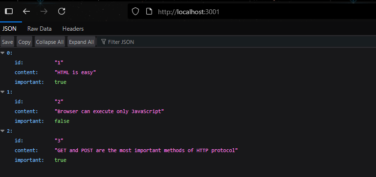

# [Node.js and Express](https://fullstackopen.com/en/part3/node_js_and_express)

In this part, our focus shifts towards the backend: that is, towards implementing functionality on the server side of the stack.

We will be building our backend on top of NodeJS, which is a JavaScript runtime based on Google's Chrome V8 JavaScript engine.

As mentioned in part 1, browsers don't yet support the newest features of JavaScript, and that is why the code running in the browser must be transpiled with e.g. babel. The situation with JavaScript running in the backend is different. The newest version of Node supports a large majority of the latest features of JavaScript, so we can use the latest features without having to transpile our code.

Our goal is to implement a backend that will work with the notes application from part 2. However, let's start with the basics by implementing a classic "hello world" application.

We had already mentioned npm back in part 2, which is a tool used for managing JavaScript packages. In fact, npm originates from the Node ecosystem.

- Create a directory for app
  - I made _simpleapp_ 
  - Navigate to the directory and create template for new app using `npm init` command
  - Answer the questions and a _package.json_ file will be generated that contains info about the project:

```json
{
  "name": "simpleapp",
  "version": "1.0.0",
  "main": "index.js",
  "scripts": {
    "test": "echo \"Error: no test specified\" && exit 1"
  },
  "author": "",
  "license": "ISC",
  "description": ""
}
```

- File specifies that entry point of app is _index.js_ file
- Add a new script:

```json
{
  // ...
  "scripts": {
    "start": "node index.js",
    "test": "echo \"Error: no test specified\" && exit 1"
  },
  // ...
}
```

- Add an _index.js_ file at the root of the project
  - Add some code:

```js
console.log('hello world')
```

- Run it:

```bash
node index.js
```

- Or run it using the script:

```bash 
npm start
```

- The script works since we defined it in the _package.json_ file
  - It is normal to have npm scripts for executing tasks for npm projects

### Simple web server

- Make app into web server by editing _index.js_:

```js
const http = require('http')

const app = http.createServer((request, response) => {
  response.writeHead(200, { 'Content-Type': 'text/plain' })
  response.end('Hello World')
})

const PORT = 3001
app.listen(PORT)
console.log(`Server running on port ${PORT}`)
```

- Running the app prints to the console:

```bash
Server running on port 3001
```

- Open app in browser by navigating to http://localhost:3001/
- The first line of code `const http = require('http')` imports Node's built in web server module
  - This is different syntax for `import http from 'http'` 
  - Node.js uses CommonJS modules, which function almost exactly like ES6 modules but Node.js doesn't fully support ES6 modules yet
- The next chunk of code:

```js
const app = http.createServer((request, response) => {
  response.writeHead(200, { 'Content-Type': 'text/plain' })
  response.end('Hello World')
})
```

- `createServer` method of http module used to create a new web server
- _event handler_ is registered to the server
  - It is called every time an HTTP request is made to the server's address http://localhost:3001/
  - This means that whenever someone visits the site, that function is called
- Request is responded to with status code 200
  - _Content-Type_ header set to _text/plain_
  - Content of site to be returned set to 'Hello World'
  - This is because the server returns plain text, which the browser will automatically want to display
    - There are other content types that do other things, for example _text/html_ will render as HTML onto the browser 
- Last lines of code bind the http server assigned to the `app` var, to listen to HTTP requests sent to port 3001
- In this course backend server will offer raw JSON data to front end
  - Change server to return hardcoded list of notes in JSON format:

```js
const http = require('http')


let notes = [
  {
    id: "1",
    content: "HTML is easy",
    important: true
  },
  {
    id: "2",
    content: "Browser can execute only JavaScript",
    important: false
  },
  {
    id: "3",
    content: "GET and POST are the most important methods of HTTP protocol",
    important: true
  }
]

const app = http.createServer((request, response) => {
  response.writeHead(200, { 'Content-Type': 'application/json' })
  response.end(JSON.stringify(notes))
})

const PORT = 3001
app.listen(PORT)
console.log(`Server running on port ${PORT}`)
```

- Restart the server and refresh the browser
- _Content-Type_ header is set to _application/json_, which informs the receiver (browser) that the data is in JSON format
  - `notes` array is transformed into JSON formatted string with `JSON.stringify(notes)` method
    - This is necessary since `response.end()` method expects a string or a buffer to send as the response body
- The browser displays a format that is exactly the same as in part 2 where we created a json-server to serve notes:



### Express

- This library makes server-side development easier
  - Define it as a dependency:

```bash
npm install express
```

- It will get added to _package.json_
- The source code for the dependency can be found in _node_modules_ directory
  - It will contain the dependencies for express and all the dependencies for those dependencies
    - These are called transitive dependencies
- A caret can exist in front of the version number in _package.json_
  - `"express": "^4.21.2"`
  - npm uses [semantic versioning](https://docs.npmjs.com/about-semantic-versioning), so the caret indicates that Express's version will be at least 4.21.2
- Dependencies can be updated by doing:

```bash
npm update
```

- If working on different computer, install all dependencies:

```bash
npm install
```

- The app should be backwards compatible as long as the _major_ number (number on the left end) is the same

### Web and Express

- Changes to _index.js_ and then restart server:

```js
const express = require('express')
const app = express()

let notes = [
  ...
]

app.get('/', (request, response) => {
  response.send('<h1>Hello World!</h1>')
})

app.get('/api/notes', (request, response) => {
  response.json(notes)
})

const PORT = 3001
app.listen(PORT, () => {
  console.log(`Server running on port ${PORT}`)
})
```

- First, we import `express` 
  - It's a _function_ that we use to create an Express app assigned to `app` var
- Next, two routes to app are defined
  1. First one defines an event handler that handles HTTP GET requests to the app's root
  - The event handler takes two params
    - The first is the request, which contains all info of the HTTP request
    - The second response param is used to define how the request should be responded to 
      - Request answered by using `send` method of `response` object
      - This method causes server to respond to the HTTP request by sending a response that contains the string that was passed in the `send` method
      - Param is a string, so Express automatically adjusts the _Content-Type_ header to be the _text/html_ one
      - Status code of response defaults to 200
      - This can be verified in the _dev tools_ console tab
  2. Second one defines an event handler that handles HTTP GET requests made to the _notes_ path of the app
     - Request responded with json method of `response` object
     - This method _auto_ formats the to JSON formatted string
     - Express _auto_ handles the _Content-Type_ header

### Automatic Change Tracking

- To see change we have to stop the app, and then restart it
- Instead, you can make the server track changes using the `--watch` option:

```bash
node --watch index.js
```

- The browser still needs to be refreshed 
- Make custom script to start development server with tracking:

```json
"dev": "node --watch index.js"
```

- Run it using:

```bash
npm run dev
```

- We have to use run here since `dev` isn't a built in script
  - Start is an exception to this rule

### REST

- Update app to provide same RESTful HTTP API as json-server (what we used to use in part 2)

>Representational State Transfer, aka REST, was introduced in 2000 in Roy Fielding's dissertation. REST is an architectural style meant for building scalable web applications.

- In REST, singular things, like notes, are called _resources_ 
  - Every resource has an associated URL which is the resource's unique address
- A convention for unique address is combining the name of the resource type with the unique identifier
  - Assume root URL of service is _www.exampleapp.com/api_
  - If resource type is notes, then address of unique note 10 is _www.exampleapp.com/api/notes/10_ 
  - URL for whole collection is _www.exampleapp.com/api/notes_
- Different operations can be done on resources
  - Operation depends on HTTP _verb_:

| URL       | Verb   | Functionality                                                      |
|-----------|--------|---------------------------------------------------------------------|
| notes/10  | GET    | Fetches a single resource                                           |
| notes     | GET    | Fetches all resources in the collection                             |
| notes     | POST   | Creates a new resource based on the request data                    |
| notes/10  | DELETE | Removes the identified resource                                     |
| notes/10  | PUT    | Replaces the entire identified resource with the request data       |
| notes/10  | PATCH  | Replaces a part of the identified resource with the request data    |

- This defines a uniform interface, which is a consistent way to define interfaces to allow cooperation between systems

### Fetching a single resource

- Add REST interface to operate on individual notes
  - First, create route for fetching single resource
- Unique address will use an individual note's unique number 
- Define parameters for routes using colon syntax in Express:

```js
app.get('/api/notes/:id', (request, response) => {
  const id = request.params.id
  const note = notes.find(note => note.id === id)
  response.json(note)
})
```

- This 'function' will handle all HTTP GET requests of the form _/api/notes/SOMETHING_ where _SOMETHING_ is an arbitrary string
- _id_ param accessed through request object's `params` method
- The note is found using `find` 
  - It is returned in the response
- If non-existent note is requested, then HTTP status code 200 is returned, meaning success
  - No data was sent back though
  - This is due to `note` var being set to `undefined` if no match is found
  - The server needs to return status code 404 not found instead

```js
app.get('/api/notes/:id', (request, response) => {
  const id = request.params.id
  const note = notes.find(note => note.id === id)
  

  if (note) {
    response.json(note)
  } else {
    response.status(404).end()
  }
})
```

- We can use the `status` method to set the status, and the `end` method to respond to the request without sending any data
- The app doesn't return anything to show to user
  - We can give them a clue by overriding the default NOT FOUND message

### Deleting resources 

- Create route to delete resources
  - HTTP request is made to DELETE request to URL of resource:

```js
app.delete('/api/notes/:id', (request, response) => {
  const id = request.params.id
  notes = notes.filter(note => note.id !== id)

  response.status(204).end()
})
```

- If resource deletion is successful, then respond to request with status code 204 no content
  - Return no data 

### Postman

- Could write JS code to test deletion
  - CMDL program, [curl](https://curl.se/), makes this easier
  - Will use [Postman](https://www.postman.com/) instead
- Postman is easy to use in this simple case 
  - It also has a VSCode extension
  - Just select the _DELETE_ verb and give it the URL of the note to delete
  - HTTP GET on that URL shows that Postman worked and that note has been deleted

### The Visual Studio Code REST client

- Can use VSC REST client plugin instead of Postman
- Make directory at root of app called _requests_ 
  - Save all REST client requests in directory as files with _.rest_ extension

 

- After clicking _Send Request_ another window will open with the HTTP response from the server

### Receiving data

- Add new notes by making HTTP POST request to address http://localhost:3001/api/notes
  - Send all info for new note in the request body in JSON format
  - To access data easily, use Express json-parser with command `app.use(express.json()) `:

```js
const express = require('express')
const app = express()

app.use(express.json())

//...

app.post('/api/notes', (request, response) => {
  const note = request.body
  console.log(note)
  response.json(note)
})
```

- Event handler accesses data from body of `request` object
  - Without json-parser, _body_ property would be undefined
  - Parser takes JSON data, transforms it into JS object and attaches it to the _body_ property of `request` before handler is called
- Verify it works with Postman
  - Postman shows what returns at the bottom of its UI
- New test can be made in REST client file:

```rest
POST http://localhost:3001/api/notes/
Content-Type: application/json

{
    "content": "postman good testing",
    "important": true
}
```

- [Multiple tests can also be put in one file](https://github.com/Huachao/vscode-restclient/blob/master/README.md#usage):

```rest
GET http://localhost:3001/api/notes/

###

POST http://localhost:3001/api/notes/ HTTP/1.1
content-type: application/json

{
    "name": "sample",
    "time": "Wed, 21 Oct 2015 18:27:50 GMT"
}
```

- When debugging, headers can be seen by doing `request.headers` or `request.get('content-type' or specify other headers)`
- Complete handling the request for new note:

```js
app.post('/api/notes', (request, response) => {
  const maxId = notes.length > 0
    ? Math.max(...notes.map(note => Number(note.id))) 
    : 0

  const note = request.body
  note.id = String(maxId + 1)

  notes = notes.concat(note)

  response.json(note)
})
```

- Need unique id for note
  - First, get largest id number
  - Then create note from `request.body` 
  - Add one to the largest id to determine new note's id
    - Not recommended method
- HTTP POST request can add notes with arbitrary properties
  - Make it so _content_ property of note can not be empty
  - _important_ property will be false by default
  - All other properties are discarded

```js
const generateId = () => {
  const maxId = notes.length > 0 
    ? Math.max(...notes.map(n => Number(n.id)))
    : 0
  return String(maxId + 1)
}

app.post('/api/notes', (request, response) => {
  const body = request.body

  if (!body.content) {
    return response.status(400).json({
      error: 'missing content'
    })
  }

  const note = {
    content: body.content,
    important: body.important || false,
    id: generateId()
  }

  notes = notes.concat(note)

  response.json(note)
})
```

- Server responds to request with 400 bad request if no content provided
  - Notice that `return response.status(400).json({})` uses a return
  - Return prevents rest of the code from being executed and a faulty note being added
- The _important_ property is created in a particular way
  - Uses || to check if `body.important` is truthy; if not, it falls back to false
  - || returns the first truthy value from left to right
  - Ensures a value is always assigned, even if the field is missing
- Since our ids are stored as strings, we have to use map to convert them to numbers first
  - The spread syntax turns `Math.max(...[1, 2, 3])` into `Math.max(1, 2, 3)`

### About HTTP request types

- Request types have two important properties: safety and idempotency
- An HTTP GET request should be safe
  - This means that it does not cause any side effects on the server and only data is retrieved; the state of the database should not change
  - Nothing guarantees a request to be safe, but it is a recommendation
  - Safe also applies to HEAD
- All HTTP requests should be idempotent (except for post)
  - If a request does not generate side effects, then the result of the request should be the same no matter how many times the request is sent
- POST is neither safe nor idempotent

### Middleware

- These are functions that handle `request` and `response` objects
- Express json-parser is middleware
  - It takes in raw data from requests stored in `request` object, parses it into JS object and assigns it to `request` object as a new property `body`
- Can use multiple middlewares
  - They are called in the order they are listed in the code
- Create middleware to print request info
- Middleware function receives 3 parameters:

```js
const requestLogger = (request, response, next) => {
  console.log('Method:', request.method)
  console.log('Path:  ', request.path)
  console.log('Body:  ', request.body)
  console.log('---')
  next()
}
```

- At end of function, `next` function is called
  - `next` yields control to the next middleware
- Middleware is used like this:

```js
app.use(requestLogger)
```

- `json-parser` listed before `requestLogger` to initialize `request.body`
- Middleware functions have to be used before routes
  - Can be called after route if no route handler processes the HTTP request
  - Make middleware to catch requests made to non-existent routes:

```js
const unknownEndpoint = (request, response) => {
  response.status(404).send({ error: 'unknown endpoint' })
}

app.use(unknownEndpoint)
```