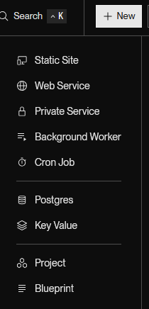
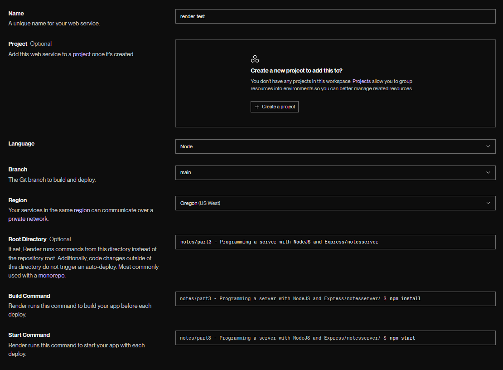

# [Deploying app to internet](https://fullstackopen.com/en/part3/deploying_app_to_internet)

- We will connect the _notes_ app frontend to the backend 
- Frontend could aks for notes from json-server backend on address http://localhost:3001/notes
  - New backend has diff structure, and notes at http://localhost:3001/api/notes
- Change `baseUrl` var to reflect this:

```js
const baseUrl = 'http://localhost:3001/api/notes'
```

- The frontend's GET request does not work
  - Why error?

### Same origin policy and CORS

- Problem with `same origin policy`
- URL's origin defined by combo of protocal (scheme), hostname, and port

```
http://example.com:80/index.html
  
protocol: http
host: example.com
port: 80
```
- CORS and Same-Origin Policy
  - When visiting a website (e.g. http://example.com), the browser makes a request to the server that hosts the domain.
    - The server responds with an HTML file, which may contain references to external assets (images, CSS, JS).
    - These assets may be on:
      - the same server
      - or a different server/domain (cross-origin)
- Same-Origin Policy
  - Browsers implement a same-origin policy to protect users from security threats (e.g. session hijacking).
  - Two URLs are considered the same origin if they share:
    1. Scheme (http vs https)
    2. Host (e.g. example.com)
    3. Port (e.g. :3001)
  - If a resource (script, data, etc.) is not from the same origin, the browser will:
    - Check if the server allows it using the Access-Control-Allow-Origin response header.
    - If the header contains * or the correct origin → allow the request
    - If the header is missing or incorrect → block the request and show a CORS error
- CORS (Cross-Origin Resource Sharing)
  - CORS is a mechanism defined by W3C that allows a server to permit cross-origin requests.
  - CORS enables:
    - Embedding images, stylesheets, scripts, iframes, videos from other origins
  - CORS restricts by default:
    - JavaScript (e.g. fetch, XMLHttpRequest) from making cross-origin requests unless explicitly allowed by the server
- Problem arises due to our server being on localhost port 5173, but our frontend being on port 3001
  - The origin is different
- Can allow requests from other _origins_ through Node's cors middleware
  - Install cors in backend: `npm install cors`
  - Use the middleware and allow requests from all origins:

```js
const cors = require('cors')

app.use(cors())
```

- Be intentional when enabling cors
  - In production, backend shouldn't be visible to public,. so only enable cors from specific origin
    - Such as frontend
- Almost all functionality works, except for changing importance due to not being implemented in the backend yet
- App setup:


- React app fetches data from node/express-server running on localhost:3001

### Application to the Internet

- Move app to internet since stack is ready
- Will use PaaS (Platform as a Service)
  - Allows user to not worry about underlying infrastructure
  - Can use [Heroku](http://heroku.com/) (student plan is alright), [Fly.io](https://fly.io/), [Render](https://render.com/), [Replit](https://replit.com/), or [CodeSandBox](https://codesandbox.io/)
  - Will stick to Render in this course
- For Render, we need to change definition of the port our app uses in `index.js`:

```js
const PORT = process.env.PORT || 3001
app.listen(PORT, () => {
  console.log(`Server running on port ${PORT}`)
})
```

#### Render

- Create a new _Web Service_



- Connect a public repo
- Define basic configs
  - If app is not at root of repo, then _Root directory_ needs to be given proper value:

