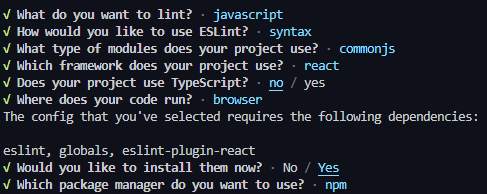

# [Validation and ESLint](https://fullstackopen.com/en/part3/validation_and_es_lint)

- Want constraints on data stored in db
  - Don't want to add notes with empty _content_ property
  - Check note validity in route handler: 

```js
app.post('/api/notes', (request, response) => {
  const body = request.body

  if (!body.content) {
    return response.status(400).json({ error: 'content missing' })
  }

  // ...
})
```

- If note's _content_ is missing, then server responds with status code 400 _bad request_
- Can also use validation functionality in Mongoose
  - Can define validation rules for each field in schema:

```js
const noteSchema = new mongoose.Schema({
  content: {
    type: String,
    minLength: 5,
    required: true
  },
  important: Boolean
})
```

- _minLength_ and _required_ validators are provided by Mongoose
  - We can make custom validators if the built-in ones are not enough
- If you try to store an invalid note, then operation will throw exception
  - Change code to pass exception to error handler middleware:

```js
app.post('/api/notes', (request, response, next) => {
  const body = request.body

  const note = new Note({
    content: body.content,
    important: body.important || false,
  })

  note.save()
    .then(savedNote => {
      response.json(savedNote)
    })
    .catch(error => next(error))
})
```

- Change middleware to reflect validation errors:

```js
const errorHandler = (error, request, response, next) => {
  console.error(error.message)

  if (error.name === 'CastError') {
    return response.status(400).send({ error: 'malformatted id' })
  } else if (error.name === 'ValidationError') {
    return response.status(400).send({ error: error.message })
  }
  next(error)
}
```

- Default Mongoose message is displayed:


### Deploying the database backend to production

- Do not need to make another production build since we have only worked on the backend
- `dotenv` will not work if we are in _production mode_ (i.e. Render)
- For production, we have to set the db URL in the service that is hosting our app
  - This is the env var tab in Render

### [Lint](https://en.wikipedia.org/wiki/Lint_(software))

> Generically, lint or a linter is any tool that detects and flags errors in programming languages, including stylistic errors. The term lint-like behavior is sometimes applied to the process of flagging suspicious language usage. Lint-like tools generally perform static analysis of source code.

- Best static analysis ("linting") tool for JS is [ESLint](https://eslint.org/)
- Add as a _development dependency_ meaning it is not needed for production in the backend:

```bash
npm install eslint @eslint/js --save-dev
```

- It appears as so in _package.json_:

```js
"devDependencies": {
  "@eslint/js": "^9.29.0",
  "eslint": "^9.29.0"
}
```

- Initialize default ESLint config with command:

```bash
npx eslint --init
```

- Answer the questions:



- Configuration is saved in generated `eslint.config.mjs` file

### Formatting the Configuration File

- Format `eslint.config.mjs` to the following:

```mjs
import globals from 'globals'

export default [
  {
    files: ['**/*.js'],
    languageOptions: {
      sourceType: 'commonjs',
      globals: { ...globals.node },
      ecmaVersion: 'latest',
    },
  },
]
```

- ESLint config file defines `files` option with `["**/*.js"]` 
  - This tells ESLint to look at all JS files 
- `languageOptions` property specifies options related to language features that should be expected
  - Define `sourceType` option as "commonjs", which indicates that JS code in project uses CommonJS module system
  - `globals` option specifies predefined global vars
    - spread operator tells ESLint to include all global vars defined in `globals.node` settings such as `process` 
  - `ecmaVersion` is set to latest, which sets the ECMAScript version to latest so ESLint knows to expect the latest JS syntax and features
- Want to use [ESLint's recommended settings](https://eslint.org/docs/latest/use/configure/configuration-files#using-predefined-configurations) with ours
  - `@eslint/js` package we installed provides us with predefined configs
  - We can import them:

```mjs
import globals from 'globals'
import js from '@eslint/js'
// ...

export default [
  js.configs.recommended,
  {
    // ...
  },
]
```

- Since the recommended configs are at the top of the array, they will be applied first
- Install plugin for code style-related rules:

```bash
npm install --save-dev @stylistic/eslint-plugin-js
```

- Import and enable plugin, add four code style rules:

```mjs
import globals from 'globals'
import js from '@eslint/js'
import stylisticJs from '@stylistic/eslint-plugin-js'

export default [
  {
    // ...
    plugins: { 
      '@stylistic/js': stylisticJs,
    },
    rules: { 
      '@stylistic/js/indent': ['error', 2],
      '@stylistic/js/linebreak-style': ['error', 'unix'],
      '@stylistic/js/quotes': ['error', 'single'],
      '@stylistic/js/semi': ['error', 'never'],
    }, 
  },
]
```

- Plugins extend ESLint capabilities
- `@stylistic/eslint-plugin-js` adds JS stylistic rules 
  - Also indent, linebreak, quotes, and semicolons

### Running the Linter

- Inspecting and validating a file such as `index.js` can be done with the following command:

```bash
npx eslint index.js
```

- Recommended to create separate `npm script` for linting:

```js
{
  // ...
  "scripts": {
    "start": "node index.js",
    "dev": "node --watch index.js",
    "test": "echo \"Error: no test specified\" && exit 1",
    "lint": "eslint ."
    // ...
  },
  // ...
}
```

- `npm run lint` will check every file in the project
  - Files in the `dist` directory will also get checked
  - To avoid this, add an object with ignores property:

```mjs
// ...
export default [
  js.configs.recommended,
  {
    files: ['**/*.js'],
    // ...
  },

  { 
    ignores: ['dist/**'], 
  },
]
```

- Can use the VS Code ESLint plugin

### Adding More Style Rules

- eqeqeq rule checks if triple equality is used
  - Add it to config file:

```mjs
export default [
  // ...
  rules: {
    // ...
   eqeqeq: 'error',
  },
  // ...
]
```

- Add rules for
  - Unnecessary trailing spaces
  - Require space before and after curly braces
  - Consistent use of white space in function params for arrow functions
- Imported default config has many rules
  - Includes rule that warns of `console.log` commands, which we don't want
  - Remove by defining its value as 0 or `off`:

```mjs
[
  {
    // ...
    rules: {
      // ...
      eqeqeq: 'error',
      'no-trailing-spaces': 'error',
      'object-curly-spacing': ['error', 'always'],
      'arrow-spacing': ['error', { before: true, after: true }],
      'no-console': 'off',
    },
  },
]
```

- Can just use a ready-made config from someone else's project in yours
  - [Airbnb JS style guide](https://github.com/airbnb/javascript) is popular