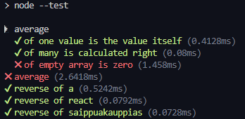

# [Structure of backend application, introduction to testing](https://fullstackopen.com/en/part4/structure_of_backend_application_introduction_to_testing)

Will continue working on backend notesapp from part 3

### Project structure

- Modify structure of project to adhere to Node.js best practices:

```
├── controllers
│   └── notes.js
├── dist
│   └── ...
├── models
│   └── note.js
├── utils
│   ├── config.js
│   ├── logger.js
│   └── middleware.js  
├── app.js
├── index.js
├── package-lock.json
├── package.json
```

- Put all printing to console in its own module _utils/logger.js_:

```js
const info = (...params) => {
  console.log(...params)
}

const error = (...params) => {
  console.error(...params)
}

module.exports = { info, error }
```

- Module can be used for `error` or `info` 
- Extracting it is a good idea for writing logs to a file or an external service
  - We would only have to change the logging in one place 
- Handling of env vars extracted to _utils/config.js_ file:

```js
require('dotenv').config()

const PORT = process.env.PORT
const MONGODB_URI = process.env.MONGODB_URI

module.exports = { MONGODB_URI, PORT }
```

- Other parts of app access env vars by importing config module:

```js
const config = require('./utils/config')

logger.info(`Server running on port ${config.PORT}`)
```

- Route handlers moved into dedicated directory
  - They are called _controllers_, so that is what we will call the directory
- It will all be in a file called _notes.js_
- It is very similar to _index.js_ file with some key differences
  - At the top we create a [router](https://expressjs.com/en/api.html#router) object: 

```js
const notesRouter = require('express').Router()

//...

module.exports = notesRouter
```

 - The router is exported to be available to any consumer that wants to use it
 - Routes are defined for router object
   - Similar to before
 - Now a route's path looks like:

```js
notesRouter.delete('/:id', (request, response, next) => { })
```

- The router is a middleware
  - Used to define 'related routes' in a single place, which is typically placed in its own module
  - Any connection to our _api/notes_ is a similar route
  - The router is used if the URL of the request starts with _/api/notes_, as will be shown 
    - Hence, we only need to define the relative parts of the route (i.e. empty path / or param _/:id_)
- _app.js_ takes the router into use:

```js
const notesRouter = require('./controllers/notes')
app.use('/api/notes', notesRouter)
```

- _app.js_ defines the app and should be created in the root directory of the project:

```js
const express = require('express')
const mongoose = require('mongoose')
const config = require('./utils/config')
const logger = require('./utils/logger')
const middleware = require('./utils/middleware')
const notesRouter = require('./controllers/notes')

const app = express()

logger.info('connecting to', config.MONGODB_URI)

mongoose
  .connect(config.MONGODB_URI)
  .then(() => {
    logger.info('connected to MongoDB')
  })
  .catch((error) => {
    logger.error('error connection to MongoDB:', error.message)
  })

app.use(express.static('dist'))
app.use(express.json())
app.use(middleware.requestLogger)

app.use('/api/notes', notesRouter)

app.use(middleware.unknownEndpoint)
app.use(middleware.errorHandler)

module.exports = app
```

- File uses different middleware
  - One is _notesRouter_ that is attached to _/api/notes_ route 
- Custom middleware is moved to new _utils/middleware.js_ module:

```js
const logger = require('./logger')

const requestLogger = (request, response, next) => {
  logger.info('Method:', request.method)
  logger.info('Path:  ', request.path)
  logger.info('Body:  ', request.body)
  logger.info('---')
  next()
}

const unknownEndpoint = (request, response) => {
  response.status(404).send({ error: 'unknown endpoint' })
}

const errorHandler = (error, request, response, next) => {
  logger.error(error.message)

  if (error.name === 'CastError') {
    return response.status(400).send({ error: 'malformatted id' })
  } else if (error.name === 'ValidationError') {
    return response.status(400).json({ error: error.message })
  }

  next(error)
}

module.exports = {
  requestLogger,
  unknownEndpoint,
  errorHandler
}
```

- _app.js_ will be in charge of connecting to db 
- _models/note.js_ will only define Mongoose schema for notes:

```js
const mongoose = require('mongoose')

const noteSchema = new mongoose.Schema({
  content: {
    type: String,
    required: true,
    minlength: 5
  },
  important: Boolean,
})

noteSchema.set('toJSON', {
  transform: (document, returnedObject) => {
    returnedObject.id = returnedObject._id.toString()
    delete returnedObject._id
    delete returnedObject.__v
  }
})

module.exports = mongoose.model('Note', noteSchema)
```

- That model is then imported into _notes.js_, which is in charge of all the routing
- _index.js_ is used for starting the file and gets simplified:

```js
const app = require('./app') // the actual Express application
const config = require('./utils/config')
const logger = require('./utils/logger')

app.listen(config.PORT, () => {
  logger.info(`Server running on port ${config.PORT}`)
})
```

- _index.js_ file imports actual app (it is an express app) from _app.js_ and starts the app
  - `info` function of logger module used to print to console if app is working
- Now, Express app and code taking care of web server are separate and follow [best practices](https://dev.to/nermineslimane/always-separate-app-and-server-files--1nc7)
- "One of the advantages of this method is that the application can now be tested at the level of HTTP API calls without actually making calls via HTTP over the network, this makes the execution of tests faster."
- For smaller apps the structure does not matter much
  - For larger ones it is good to organize the modules
  - There is no strict structure, these are just good practices

### Note on exports

- Two types of exports in this app
  - One is in _logger.js_:

```js
const info = (...params) => {
  console.log(...params)
}

const error = (...params) => {
  console.error(...params)
}

module.exports = { info, error }
```

- An object with two fields is exported 
  - When importing, you can use this in two ways:
    1. Refer to the functions using the dot param 

```js
const logger = require('./utils/logger')

logger.info('message')
logger.error('error message')
```
   2. Destructure the function into their own vars:

```js
const { info, error } = require('./utils/logger')

info('message')
error('error message')
```

- The second way of exporting is favorable when you only use a small portion of the exported functions

### Testing Node apps

- Will do some unit testing
  - Create file *utils/for_testing.js* and write functions for test writing practice:

```js
const reverse = (string) => {
  return string
    .split('')
    .reverse()
    .join('')
}

const average = (array) => {
  const reducer = (sum, item) => {
    return sum + item
  }

  return array.reduce(reducer, 0) / array.length
}

module.exports = {
  reverse,
  average,
}
```

- There are many _test runners_ (libraries)
  - We will use Node's built in library node:test
- Npm script `test` for test execution:

```js
"test": "node --test",
```

- Create _tests_ directory with file _reverse.test.js_:

```js
const { test } = require('node:test')
const assert = require('node:assert')

const reverse = require('../utils/for_testing').reverse

test('reverse of a', () => {
  const result = reverse('a')

  assert.strictEqual(result, 'a')
})

test('reverse of react', () => {
  const result = reverse('react')

  assert.strictEqual(result, 'tcaer')
})

test('reverse of saippuakauppias', () => {
  const result = reverse('saippuakauppias')

  assert.strictEqual(result, 'saippuakauppias')
})
```

- `test` and library assert used to check result of functions we are testing
- `const reverse = require('../utils/for_testing').reverse` imports function to test and assigns to var `reverse`
- Test cases defined with `test` func
  - First argument is description as string
  - Second argument is _function_ that defines functionality for test case
    - The functionality for the test cases executes the code to be tested first (i.e. generate a string for the reverse of 'react')
    - Then the result is verified with the method `strictEqual` of the assert library
- Follow convention to end test file names with `.test.js` since _node:test_ testing library auto executes test files named this way
- If the test passes then it is very obvious, if the test fails then it displays the actual output and the expected output
- Create _tests/average.test.js_ for testing average function:

```js
const { test, describe } = require('node:test')
const assert = require('node:assert')

const average = require('../utils/for_testing').average

describe('average', () => {
  test('of one value is the value itself', () => {
    assert.strictEqual(average([1]), 1)
  })

  test('of many is calculated right', () => {
    assert.strictEqual(average([1, 2, 3, 4, 5, 6]), 3.5)
  })

  test('of empty array is zero', () => {
    assert.strictEqual(average([]), 0)
  })
})
```

- Average does not work on empty array
  - Fix:

```js
const average = array => {
  const reducer = (sum, item) => {
    return sum + item
  }

  return array.length === 0
    ? 0
    : array.reduce(reducer, 0) / array.length
}
```

- A describe block was used around the tests 
  - This block was given the name `average`:

```js
describe('average', () => {
  // tests
})
```

- These blocks can be used for grouping tests into collections:



- Compared to the tests for reverse, these are very compact
  - We don't assign the output of the function to a var to be tested:

```js
test('of empty array is zero', () => {
  assert.strictEqual(average([]), 0)
})
```