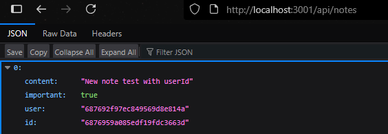
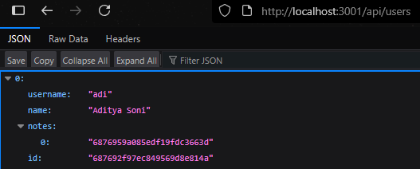
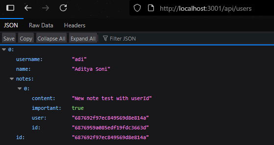
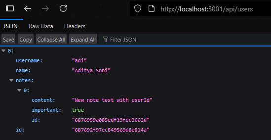
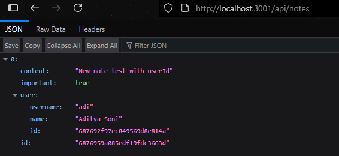

# [User administration](https://fullstackopen.com/en/part4/user_administration)

- Want to add user authentication and authorization
  - User stored in db and every note linked to a user
    - One to many relationship
  - Only a user who made a note can delete it
- To make our life easy we will save users in their own collection called _users_
- Will use object IDs in mongo to reference documents in other collections
  - Like using foreign keys in relational db
- Mongo 3.2 has lookup aggregation queries, which we will use
- Will use multiple queries to join and do stuff

### Reference across collections

- We can do a reference-based approach similar to relational dbs
- Assume _users_ collection has 2 users:

```js
[
  {
    username: 'mluukkai',
    _id: 123456,
  },
  {
    username: 'hellas',
    _id: 141414,
  },
]
```

- _notes_ collection has three notes that all have _user_ field that references a user in the _users_ collection:

```js
[
  {
    content: 'HTML is easy',
    important: false,
    _id: 221212,
    user: 123456,
  },
  {
    content: 'The most important operations of HTTP protocol are GET and POST',
    important: true,
    _id: 221255,
    user: 123456,
  },
  {
    content: 'A proper dinosaur codes with Java',
    important: false,
    _id: 221244,
    user: 141414,
  },
]
```

- In document db, foreign key can be stored in _notes_ collection or _users_ collection or both:

```js
[
  {
    username: 'mluukkai',
    _id: 123456,
    notes: [221212, 221255],
  },
  {
    username: 'hellas',
    _id: 141414,
    notes: [221244],
  },
]
```

- _note_ ids stored in array
- Since document db, can also store all notes in array in _users_ collection
- More freedom in document db means that programmer makes lots of important decisions about storage before knowing what functionality is needed 
- Can make life easier or harder

### Mongoose schema for users

- We will store the ids of notes created by user in the user document
- Create model for representing a user in _models/user.js_ file:

```js
const mongoose = require('mongoose')

const userSchema = new mongoose.Schema({
  username: String,
  name: String,
  passwordHash: String,
  notes: [
    {
      type: mongoose.Schema.Types.ObjectId,
      ref: 'Note'
    }
  ],
})

userSchema.set('toJSON', {
  transform: (document, returnedObject) => {
    returnedObject.id = returnedObject._id.toString()
    delete returnedObject._id
    delete returnedObject.__v
    // the passwordHash should not be revealed
    delete returnedObject.passwordHash
  }
})

const User = mongoose.model('User', userSchema)

module.exports = User
```

- IDs of notes stored within user document as array of Mongo ids:

```js
{
  type: mongoose.Schema.Types.ObjectId,
  ref: 'Note'
}
```

- Field type is _ObjectId_, meaning it refers to another document
  - _ref_ field specifies name of model being referenced
  - Mongo does not inherently know that this is a field that references notes, the syntax is related to and defined by Mongoose
- Expand note schema in _models/notes.js_ so that note contains info about user who created it:

```js
const noteSchema = new mongoose.Schema({
  content: {
    type: String,
    required: true,
    minlength: 5
  },
  important: Boolean,
  user: {
    type: mongoose.Schema.Types.ObjectId,
    ref: 'User'
  }
})
```

- References stored in both users documents and notes documents

### Creating users

- Implement route for creating users
  - Users have unique _username_, a _name_, and _passwordHash_
    - _passwordHash_ is output of one-way hash function applied to user's password
    - This is better than storing unencrypted plain text passwords in db
- Install bcrypt for making password hashes:

```bash
npm install bcrypt
```

- User created in compliance with RESTful conventions
  - Done by making HTTP POST request to _users_ path
- Define separate _router_ for dealing with users in new _controller/users.js_ file
  - Take router into use in _app.js_ file to handle requests made to _/api/users/_ url:

```js
// ...
const notesRouter = require('./controllers/notes')
const usersRouter = require('./controllers/users')
// ...
app.use('/api/notes', notesRouter)
app.use('/api/users', usersRouter)
// ...
```

- _controller/users.js_ which defines the router:

```js
const bcrypt = require('bcrypt')
const usersRouter = require('express').Router()
const User = require('../models/user')

usersRouter.post('/', async (request, response) => {
  const { username, name, password } = request.body

  const saltRounds = 10
  const passwordHash = await bcrypt.hash(password, saltRounds)

  const user = new User({
    username,
    name,
    passwordHash,
  })

  const savedUser = await user.save()

  response.status(201).json(savedUser)
})

module.exports = usersRouter
```

- Password's hash is stored in the db
- Code has no error handling or input validation for username and password
- Can test this new functionality manually, but easier with automated testing
- Initial tests:

```js
const bcrypt = require('bcrypt')
const User = require('../models/user')

//...

describe('when there is initially one user in db', () => {
  beforeEach(async () => {
    await User.deleteMany({})

    const passwordHash = await bcrypt.hash('sekret', 10)
    const user = new User({ username: 'root', passwordHash })

    await user.save()
  })

  test('creation succeeds with a fresh username', async () => {
    const usersAtStart = await helper.usersInDb()

    const newUser = {
      username: 'mluukkai',
      name: 'Matti Luukkainen',
      password: 'salainen',
    }

    await api
      .post('/api/users')
      .send(newUser)
      .expect(201)
      .expect('Content-Type', /application\/json/)

    const usersAtEnd = await helper.usersInDb()
    assert.strictEqual(usersAtEnd.length, usersAtStart.length + 1)

    const usernames = usersAtEnd.map(u => u.username)
    assert(usernames.includes(newUser.username))
  })
})
```

- Tests use _usersInDb()_ helper function created in *tests/test_helper.js* file:

```js
const User = require('../models/user')

// ...

const usersInDb = async () => {
  const users = await User.find({})
  return users.map(u => u.toJSON())
}

module.exports = {
  initialNotes,
  nonExistingId,
  notesInDb,
  usersInDb,
}
```

- _beforeEach_ block adds user with the username _root_ to db
  - Can check that users with the same username are not created:

```js
describe('when there is initially one user in db', () => {
  // ...

  test('creation fails with proper statuscode and message if username already taken', async () => {
    const usersAtStart = await helper.usersInDb()

    const newUser = {
      username: 'root',
      name: 'Superuser',
      password: 'salainen',
    }

    const result = await api
      .post('/api/users')
      .send(newUser)
      .expect(400)
      .expect('Content-Type', /application\/json/)

    const usersAtEnd = await helper.usersInDb()
    assert(result.body.error.includes('expected `username` to be unique'))

    assert.strictEqual(usersAtEnd.length, usersAtStart.length)
  })
})
```

- Test won't pass since we have not ensured uniqueness of username yet
- We are practicing TDD (test-driven-development)
  - Test written before functionality
- Mongoose validation does not give direct way to check uniqueness of field value
  - Can achieve uniqueness by defining uniqueness index for field:

```js
username: {    
  type: String,    
  required: true,    
  unique: true // this ensures the uniqueness of username  
},
```

- Caveat: if there are documents in db that violate uniqueness condition, then no index will be created
- Mongoose validations do not check index violations
  - They return `MongoServerError` 
  - Need to extend error handler for that case:

```js
const errorHandler = (error, request, response, next) => {
  if (error.name === 'CastError') {
    return response.status(400).send({ error: 'malformatted id' })
  } else if (error.name === 'ValidationError') {
    return response.status(400).json({ error: error.message })
  } else if (error.name === 'MongoServerError' && error.message.includes('E11000 duplicate key error')) {
    return response.status(400).json({ error: 'expected `username` to be unique' })
  }

  next(error)
}
```

- Now test will pass
- Can add further validations to user creation if you want
- Add implementation of router handler that returns all users in db:

```js
usersRouter.get('/', async (request, response) => {
  const users = await User.find({})
  response.json(users)
})
```

- Use the REST Client to add a new user

### Creating a new note

- Code for creating new note must be updated so that note is assigned to user who created it
- Will update _controller/notes.js_ so that info of user who created note is sent in _userId_ field of request body:

```js
notesRouter.post('/', async (request, response, next) => {
  const body = request.body

  const user = await User.findById(body.userId)

  if (!user) {
    return response.status(400).json({ error: 'userId missing or invalid' })
  }

  const note = new Note({
    content: body.content,
    important: body.important || false,
    user: user._id
  })

  const savedNote = await note.save()
  user.notes = user.notes.concat(savedNote._id)
  await user.save()
  
  response.status(201).json(savedNote)
})
```

- Db first queried for user using the _userId_
  - If user not found, then error returned
  - Otherwise new note created with _userId_
- Note saved to db
  - _noteId_ concatenated to _user.notes_ 
  - Updated user saved to db
- We can add a new note using the REST Client:

```rest
POST http://localhost:3001/api/notes/
Content-Type: application/json

{
    "content": "New note test with userId",
    "important": true,
    "userId": "687692f97ec849569d8e814a"
}
```

- The new note should look like this:



- The user looks like this:



- The tests we had created no longer work
- We will fix the frontend note creation functionality in part 5 of the course

### Populate

- Want API to work such that when HTTP GET request made to _/api/users_ route, user object contains contents of user's notes and not just their id
  - Can be done in relational db with _join query_
- In Mongoose, join is done with `populate` method
  - Update route for getting all users in _controller/users.js_:

```js
usersRouter.get('/', async (request, response) => {
  const users = await User
    .find({}).populate('notes')

  response.json(users)
})
```

- `populate()` is chained after a query like `find()` to automatically replace referenced document IDs with the actual documents
  - The argument to `populate()` specifies which field (e.g., notes) contains the references (_ObjectIds_)
- Mongoose first queries the initial collection (e.g., users) to get the documents
  - Then looks at the _ref_ defined in the schema (e.g., ref: 'Note') to know which collection to query next
  - It uses the stored _ObjectIds_ to fetch the referenced documents from the target collection (e.g., notes)
- Results in an array of full documents in the populated field:



- Can use `populate` method for choosing fields we want to include from the document
- The _id_ field is returned automatically, but we are also interested in only the _content_ and _important_ fields
- The selection is done with the Mongo syntax:

```js
usersRouter.get('/', async (request, response) => {
  const users = await User
    .find({}).populate('notes', { content: 1, important: 1 })

  response.json(users)
})
```

- Now the output will look as follows:



- When retrieving a note, we also want some user info so change _controllers/notes.js_ file:

```js
notesRouter.get('/', async (request, response) => {
  const notes = await Note
    .find({}).populate('user', { username: 1, name: 1 })

  response.json(notes)
})
```

- It looks as follows:



> It's important to understand that the database does not know that the ids stored in the user field of the notes collection reference documents in the user collection.
> The functionality of the populate method of Mongoose is based on the fact that we have defined "types" to the references in the Mongoose schema with the ref option:

```js
const noteSchema = new mongoose.Schema({
  content: {
    type: String,
    required: true,
    minlength: 5
  },
  important: Boolean,
  user: {
    type: mongoose.Schema.Types.ObjectId,
    ref: 'User'
  }
})
```