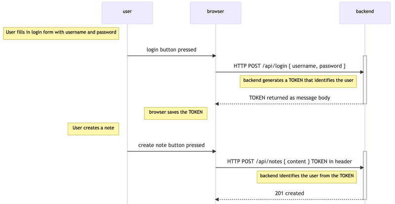
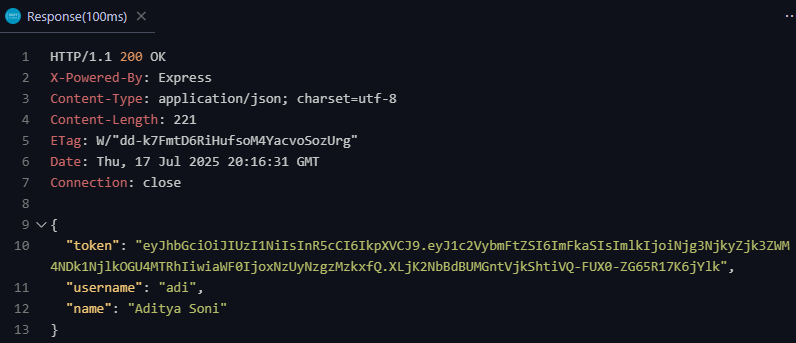

# [Token authentication](https://fullstackopen.com/en/part4/token_authentication)


- Users can log into application and when they create a new not, their info will be attatched to the note
- Implement [token-based authentication](https://www.digitalocean.com/community/tutorials/the-ins-and-outs-of-token-based-authentication#how-token-based-works)
  - Diagram for app:



- User starts by logging in using a login form implemented with React
  - We will add the login form to the frontend in part 5
- This causes the React code to send the username and the password to the server address _/api/login_ as an HTTP POST request.
- If the username and the password are correct, the server generates a token that somehow identifies the logged-in user.
  - The token is signed digitally, making it impossible to falsify (with cryptographic means)
- The backend responds with a status code indicating the operation was successful and returns the token with the response.
- The browser saves the token, for example to the state of a React application.
- When the user creates a new note (or does some other operation requiring identification), the React code sends the token to the server with the request.
- The server uses the token to identify the user

- Will implement logging in
  - Install jsonwebtokeb library for generating tokens:

```bash
npm install jsonwebtoken
```

- _controllers/login.js_ has login functionality:

```js
const jwt = require('jsonwebtoken')
const bcrypt = require('bcrypt')
const loginRouter = require('express').Router()
const User = require('../models/user')

loginRouter.post('/', async (request, response) => {
  const { username, password } = request.body

  const user = await User.findOne({ username })
  const passwordCorrect = user === null
    ? false
    : await bcrypt.compare(password, user.passwordHash)

  if (!(user && passwordCorrect)) {
    return response.status(401).json({
      error: 'invalid username or password'
    })
  }

  const userForToken = {
    username: user.username,
    id: user._id,
  }

  const token = jwt.sign(userForToken, process.env.SECRET)

  response
    .status(200)
    .send({ token, username: user.username, name: user.name })
})

module.exports = loginRouter
```

- Code starts by searching for user with the username in db
- Then it checks the _password_, which is only valid if the user was found
  - Hashes are compared using `bcrypt.compare()`
- If user is not found or password incorrect, then request responded with 201 unauthorized
  - Reason in response body
- If password correct, token created with `jwt.sign()` method
  - Token has username and user id in digitally signed form
  - Signed using env var _SECRET_ as the _secret_ 
  - Makes it so that only people who know the secret can generate valid token (imagine its like putting a nonce infront of a string in a hash)
- Successful request responded with status code _200 OK_
  - Token and user name of user sent back in response body
- Add login router to the app through _app.js_:

```js
const loginRouter = require('./controllers/login')

//...

app.use('/api/login', loginRouter)
```

- Reminder to add env var _SECRET_ to _.env_ file
- Login using VS Code TEST-client:

```rest
POST http://localhost:3001/api/login
Content-Type: application/json

{
    "username": "adi",
    "password": "fullstack"
}
```



### Limiting creating new notes to logged-in users

- Make it so that new note can only be created if post request has valid token
  - Only then is new note saved
- Many ways to send token from browser to server, will use authorization header, which also tells [authentication scheme](https://developer.mozilla.org/en-US/docs/Web/HTTP/Guides/Authentication#authentication_schemes) in use
  - Using _Bearer_ scheme 
- Example of Authorization header with a token:
  - ```Bearer eyJhbGciOiJIUzI1NiIsInR5c2VybmFtZSI6Im1sdXVra2FpIiwiaW```
- Creating new notes in _controller/notes.js_ will change: 

```js
const jwt = require('jsonwebtoken')

// ...
const getTokenFrom = request => {
  const authorization = request.get('authorization')
  if (authorization && authorization.startsWith('Bearer ')) {
    return authorization.replace('Bearer ', '')
  }
  return null
}

notesRouter.post('/', async (request, response) => {
  const body = request.body
  const decodedToken = jwt.verify(getTokenFrom(request), process.env.SECRET)
  if (!decodedToken.id) {
    return response.status(401).json({ error: 'token invalid' })
  }
  const user = await User.findById(decodedToken.id)

  if (!user) {
    return response.status(400).json({ error: 'UserId missing or not valid' })
  }

  const note = new Note({
    content: body.content,
    important: body.important || false,
    user: user._id
  })

  const savedNote = await note.save()
  user.notes = user.notes.concat(savedNote._id)
  await user.save()

  response.status(201).json(savedNote)
})
```

- `getTrokenFrom` is a hlper function that isolates the token from the _authorization_ header
  - Token validity checked with `jwt.verify`
    - This also decodes the token or returns the Object the token was based on
    - Recall that the token was based on an object that had the user's id and username
- If token is invalid or missing, exception _JsonWebTokenError_ is raised
  - Extend error handling middleware to handle this error:

```js
else if (error.name ===  'JsonWebTokenError') {    
  return response.status(401).json({ error: 'token invalid' })  
}
```

- Token has username and id, so server knows who made the request
  - If the token does not contain an id, then an error status code [401 unauthorized](https://www.rfc-editor.org/rfc/rfc9110.html#name-401-unauthorized) is returned with a message
- When identity of maker of request is resolved, execution continues as before
- Can create new note using REST Client:


 - If app has multiple interfaces that require identification, then JWT validation should be separate into own middleware
 - Can also use library like [express-jwt](https://www.npmjs.com/package/express-jwt)

### Problems of Token-based authentication

- Token has one issue
  - Should API blindly trust token holder? What if token should be revoked?
- To solve this we will choose easy solution of limiting validity period of a token
  - Do this by changing the definition of a token when declared, in _controller/login.js_:

```js
const token = jwt.sign(
  userForToken, 
  process.env.SECRET,
  { expiresIn: 60*60 }
)
```

- When token expires, client has to get a new one
  - Done by forcing user to re-login
- Need error handling incase token expires by editting error handler middleware:

```js
else if (error.name === 'TokenExpiredError') {
  return response.status(401).json({
    error: 'token expired'
  })
}
```

- Short token expiration increases security but worsens UX  
  - Users need to log in more frequently
- Alternative: use server-side sessions (store token info in backend DB)  
  - Backend checks token validity for every API request  
  - Allows revoking access at any time
- Downside: slower and more complex  
  - DB check needed per request
- Solution: store sessions in Redis  
  - Redis is a key-value store, extremely fast compared to full DBs like MongoDB
- Server-side tokens:  
  - Typically random strings, contain no user info  
  - Identity info fetched from DB on each request
- Token transport:  
  - Server-side sessions often use cookies  
  - JWT-based auth usually uses Authorization header

### End notes

- The tests dont work anymore, can fix em if u want
- Login implemented in next part