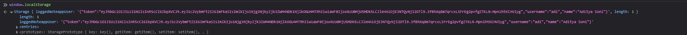

# [Login in frontend](https://fullstackopen.com/en/part5/login_in_frontend)

- Cant add new notes through the front end since backend expects a token verifying the users identity
  - Will implement user management functionality to frontend
- Will assume that new users are not added through the frontend

### Handling login

- Code in _App_ component:

```jsx
const App = () => {
  const [notes, setNotes] = useState([]) 
  const [newNote, setNewNote] = useState('')
  const [showAll, setShowAll] = useState(true)
  const [errorMessage, setErrorMessage] = useState(null)
  const [username, setUsername] = useState('') 
  const [password, setPassword] = useState('') 

  useEffect(() => {
    noteService
      .getAll().then(initialNotes => {
        setNotes(initialNotes)
      })
  }, [])

  // ...

  const handleLogin = (event) => {
    event.preventDefault()
    console.log('logging in with', username, password)
  }

  return (
    <div>
      <h1>Notes</h1>

      <Notification message={errorMessage} />

      <form onSubmit={handleLogin}>
        <div>
          username
            <input
            type="text"
            value={username}
            name="Username"
            onChange={({ target }) => setUsername(target.value)}
          />
        </div>
        <div>
          password
            <input
            type="password"
            value={password}
            name="Password"
            onChange={({ target }) => setPassword(target.value)}
          />
        </div>
        <button type="submit">login</button>
      </form>

      // ...
    </div>
  )
}

export default App
```

- Reminder to connect backend to frontend by running `npm run dev` for both (connected through prox in _vite.config.js_)
- Login form is handled the same way as before
  - App state has field for _username_ and _password_ 
  - They have event handler which synchronize changes in field to state (as shown in _part2 b_)
  - Event handlers are the same 
- Method `handleLogin` is yet to be implemented
- Logging in is done through HTTP POST request to server address _api/login_ 
  - Put this code in own module _services/login.js_
- Will use _async/await_ syntax for HTTP request:

```js
import axios from 'axios'
const baseUrl = '/api/login'

const login = async credentials => {
  const response = await axios.post(baseUrl, credentials)
  return response.data
}

export default { login }
```

- Method for logging in handled as follows:

```jsx
import loginService from './services/login'

const App = () => {
  // ...
  const [username, setUsername] = useState('') 
  const [password, setPassword] = useState('') 
  const [user, setUser] = useState(null)
  
  const handleLogin = async (event) => {
    event.preventDefault()
    
    try {
      const user = await loginService.login({
        username, password,
      })
      setUser(user)
      setUsername('')
      setPassword('')
    } catch (exception) {
      setErrorMessage('Wrong credentials')
      setTimeout(() => {
        setErrorMessage(null)
      }, 5000)
    }
    
  // ...
}
```

- Successful login clears the form fields
  - Server response is also saved to _user_ field of app's state (it includes a _token_ and user details)
- If login fails, then warning appears
- Modify login field to only show if user is not logged in (to show user if logged in or not)
  - When `user === null`
- Form for adding new notes shown only if _user is logged in
  - So when user state contains users details
- Add two helper functions to _App_ component for forms:

```jsx
const App = () => {
  // ...

  const loginForm = () => (
    <form onSubmit={handleLogin}>
      <div>
        username
          <input
          type="text"
          value={username}
          name="Username"
          onChange={({ target }) => setUsername(target.value)}
        />
      </div>
      <div>
        password
          <input
          type="password"
          value={password}
          name="Password"
          onChange={({ target }) => setPassword(target.value)}
        />
      </div>
      <button type="submit">login</button>
    </form>      
  )

  const noteForm = () => (
    <form onSubmit={addNote}>
      <input
        value={newNote}
        onChange={handleNoteChange}
      />
      <button type="submit">save</button>
    </form>  
  )

  return (
    // ...
  )
}
```

- Conditionally render them:

```jsx
const App = () => {
  // ...

  const loginForm = () => (
    // ...
  )

  const noteForm = () => (
    // ...
  )

  return (
    <div>
      <h1>Notes</h1>

      <Notification message={errorMessage} />

      {user === null && loginForm()}
      {user !== null && noteForm()}

      <div>
        <button onClick={() => setShowAll(!showAll)}>
          show {showAll ? 'important' : 'all'}
        </button>
      </div>
      <ul>
        {notesToShow.map((note, i) => 
          <Note
            key={i}
            note={note} 
            toggleImportance={() => toggleImportanceOf(note.id)}
          />
        )}
      </ul>

      <Footer />
    </div>
  )
}
```

- This employs a common [React trick](https://react.dev/learn/conditional-rendering#logical-and-operator-) to render things conditionally
  - In JSX, `{cond ? <A /> : <B />}` means “if `cond`, render `<A />`, otherwise `<B />`”
  - In JSX, `{cond && <A />}` means “if `cond`, render `<A />`, otherwise nothing”
    - This works since if the first statement (`cond`) is false the whole statement becomes false and the second statement is not rendered
- Can be simplified further:

```jsx
{user === null 
    ? loginForm() 
    : noteForm()
}
```

- Make another modification, if user is logged in then it shows their name on the screen:

```jsx
{user === null 
  ? loginForm() 
  : <div> 
    <p>{user.name} logged-in</p>
    {noteForm()}
  </div>
}
```

- This aint perfect but it works for now
- Will also refactor _App_ component into individual components 

### Creating new notes

- `user` state contains token returned on successful login

```jsx
setUser(user)
```

- Add token of logged-in user to Authorization header of HTTP request now
- _noteServices_ module changes:

```js
import axios from 'axios'
const baseUrl = '/api/notes'

let token = null

const setToken = newToken => {
  token = `Bearer ${newToken}`
}

const getAll = () => {
  const request = axios.get(baseUrl)
  return request.then(response => response.data)
}

const create = async newObject => {
  const config = {
    headers: { Authorization: token },
  }

  const response = await axios.post(baseUrl, newObject, config)
  return response.data
}

const update = (id, newObject) => {
  const request = axios.put(`${ baseUrl }/${id}`, newObject)
  return request.then(response => response.data)
}

export default { getAll, create, update, setToken }
```

- `token` variable which can be manipuated by `setToken` method, exported with module
- `create` method sets token to the Authorization header 
  - Header given to axios as third param of _post_ method
- Event handler for login must call method `noteService.setToken(user.token)` when successful login
- Adding a new note works now

### Saving the token to the browser's local storage

- Problem: if poage refreshed, user login is forgotten
  - Will solve using browser's db
- Local storage is a key-value db in the browser
- _value_ with _key_ stored in db using `setItem` method:

```js
window.localStorage.setItem('name', 'juha tauriainen')
```

- Normal key value pair stuff
- value of key found using method `getItem`:

```jsx
window.localstorage.getItem('name')
```

- `removeItem` removes a kay
- Values in local storage remains after reloading (page re-rendered)
  - Storage is [origin-specific](https://developer.mozilla.org/en-US/docs/Glossary/Origin) so each we app has its own storage
- Will extend app so details of logged-in user saved to local storage
  - Values saved as DOMstrings, so cant save JS objects as is
  - Must parse object into JSON with `JSON.stringify()`
  - Then when object read from storage, you must convert it back to JS object yusing `JSON.parse()`
- Changes to login method:

```jsx
const handleLogin = async (event) => {
  event.preventDefault()
  try {
    const user = await loginService.login({
      username, password,
    })

    window.localStorage.setItem(
      'loggedNoteappUser', JSON.stringify(user)
    ) 
    noteService.setToken(user.token)
    setUser(user)
    setUsername('')
    setPassword('')
  } catch (exception) {
    // ...
  }
}
```

- Local storage data can be seen by typing `window.localStorage` in the console



- You can also see the local storage in the _Storage_ tab
- Still need to make it so if user details are in local storage, then details are saved to state of app and to _noteService_
  - Right way to do this is to use an effect hook:

```jsx
useEffect(() => {
	const loggedUserJSON = window.localStorage.getItem('loggedNoteappUser');
	if (loggedUserJSON) {
		const user = JSON.parse(loggedUserJSON);
		setUser(user);
		noteService.setToken(user.token);
	}
}, []);
```

- Empty array as param of effect ensure effect only runs when component rendered for firt time
- Now user logged in forever
  - Need to add _logout_ functionality, this is exercise for user
    - We will just use the console and the following command: `window.localStorage.removeItem('loggedNoteappUser')` or empty the whole storage: `window.localStorage.clear()` 